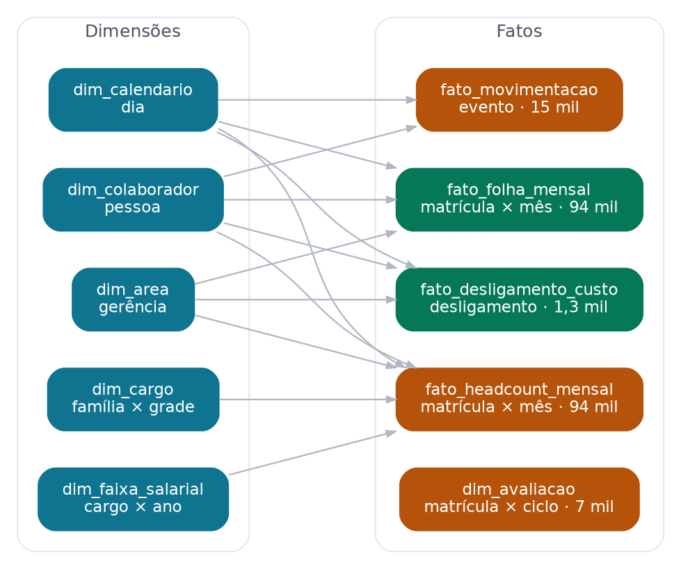

# hr-synthetic-data-br



Gerador de base sintética longitudinal de RH com contexto trabalhista
brasileiro. Simula cinco anos de vida de uma empresa de ~1.500 pessoas mês a
mês: dissídio por sindicato, ciclo de performance, mérito, promoção,
desligamento voluntário e involuntário, reestruturação e reposição.

Saída: modelo em estrela pronto para Power BI e para modelagem preditiva.

```bash
pip install -e ".[dev]"
hrsynth --config config/params.yaml
```

---

## Por que este repositório existe

Datasets públicos de RH têm dois problemas que inviabilizam um portfólio
sério:

1. **São transversais.** Uma foto única, sem histórico. Não dá para calcular
   turnover por safra, evolução de folha ou tempo até a promoção.
2. **O rótulo é independente das features.** Quando `desligado` é sorteado
   sem relação causal com salário, carreira e liderança, qualquer AUC acima
   de 0,55 é ruído — e o SHAP que você apresenta para o diretor está
   explicando aleatoriedade.

Aqui o desligamento é gerado por um **modelo de risco mensal com estrutura
causal explícita** (`src/hrsynth/hazard.py`). Existe sinal real, e você
conhece os coeficientes verdadeiros, então pode verificar se o SHAP do seu
modelo recupera a hierarquia correta de drivers.

## O que a simulação modela

| Bloco | O que está dentro |
|---|---|
| Remuneração | Dissídio com data-base por sindicato, mérito por rating, promoção com salto de faixa, atualização anual da tabela salarial |
| Carreira | Escada de 8 grades por família, elegibilidade por tempo no cargo e performance, pirâmide de senioridade por área |
| Turnover | Hazard mensal com curva em U por tempo de casa, estagnação de carreira, compa-ratio, efeito latente de gestor, sazonalidade brasileira (pico em jan/fev, vale em nov/dez), choque exógeno de mercado por ano |
| Involuntário | Risco por baixo desempenho + dois eventos de reestruturação configurados |
| Financeiro | INSS patronal, RAT, terceiros, FGTS, provisão de 13º e férias, VR/VT/plano de saúde por faixa etária, verbas rescisórias e custo de reposição por criticidade da área |

Tudo que é premissa de negócio está em `config/params.yaml`, não no código.
Quem auditar a base lê o YAML e entende o cenário sem abrir Python.

## Realismo verificado, não prometido

A CLI imprime um relatório de sanidade a cada execução:

```
metrica                        valor   status
turnover_total_anual          0.1691   OK
turnover_voluntario_anual     0.1240   OK
compa_ratio_medio             0.9512   OK
fator_custo_sobre_salario     1.9432   OK
custo_folha_ultimo_mes   36.220.354
```

Base sintética sem conferência é ficção. Se o turnover sai em 45% ou o fator
de custo sobre salário em 1,1, os parâmetros estão errados e qualquer análise
construída em cima nasce torta.

**Dificuldade do problema preditivo.** Treinando um gradient boosting simples
com corte temporal (treino até jun/24, teste jul/24–jun/25) para prever pedido
de demissão nos 6 meses seguintes:

| Métrica | Valor |
|---|---|
| Prevalência | 5,3% |
| AUC-ROC | 0,695 |
| AUC-PR | 0,138 |
| Lift no decil superior | 2,8× |

Essa é a faixa de um problema de turnover real. Base que entrega AUC 0,95
tem vazamento, não talento.

## Estrutura

```
config/params.yaml          premissas de negócio
src/hrsynth/
  catalogs.py               cargos, níveis, áreas, sindicatos
  hazard.py                 modelo de risco — a verdade-base
  people.py                 atributos cadastrais correlacionados
  simulation.py             motor mensal orientado a eventos
  payroll.py                encargos, provisões, custo de desligamento
  export.py                 montagem do esquema estrela
  cli.py                    execução + relatório de sanidade
tests/test_invariants.py    15 testes de integridade e realismo
docs/
  dicionario_dados.md       modelo estrela e descrição das colunas
  governanca_lgpd.md        decisões de privacidade
  ground_truth.md           coeficientes verdadeiros e como validar o SHAP
```

## Saída

Nove tabelas em Parquet:

| Tabela | Grão | Volume típico |
|---|---|---|
| `dim_calendario` | dia | 1.826 |
| `dim_colaborador` | pessoa | ~3.000 |
| `dim_area` | área | 15 |
| `dim_cargo` | família × grade | 64 |
| `dim_faixa_salarial` | cargo × ano | 320 |
| `fato_headcount_mensal` | matrícula × mês | ~94.000 |
| `fato_folha_mensal` | matrícula × mês | ~94.000 |
| `fato_movimentacao` | evento | ~15.000 |
| `fato_desligamento_custo` | desligamento | ~1.300 |
| `dim_avaliacao` | matrícula × ciclo | ~7.000 |

Mais dois arquivos de gabarito (`ground_truth_*`) que **não devem ser usados
como features**. São para validar o modelo, não para treiná-lo.

## Notas de implementação que valem a leitura

**A ordem dos eventos no mês importa.** Dissídio antes de desligamento, senão
a base fica com gente desligada recebendo reajuste e o forecast de folha não
fecha.

**A tabela salarial é corrigida anualmente.** Sem isso o compa-ratio da base
inteira deriva para cima ano após ano, porque o salário sobe com dissídio e
mérito enquanto a faixa ficaria congelada.

**Benefício é regressivo.** Como VR, VT e plano de saúde são valores fixos, o
custo total sobre salário vai de ~1,7 num gerente a ~3,0 num assistente. Isso
aparece no dashboard de folha e costuma surpreender quem só olha salário.

**O efeito de gestor é latente.** Cada líder recebe um efeito aleatório em
log-odds que desloca o risco de saída do time inteiro. Ele não está no fato —
está no arquivo de gabarito. Seu modelo só o captura se você construir
features agregadas de equipe. É exatamente o que acontece na prática.

## Projetos que consomem esta base

1. **Custo financeiro do turnover** — propensão de saída calibrada × custo de
   reposição, com SHAP para explicar drivers.
2. **Forecast de headcount e folha** — projeção 12–18 meses com cenários de
   dissídio, contratação e turnover, com what-if no Power BI.
3. **Equidade salarial e pay gap** — gap explicado vs. não explicado,
   compa-ratio por recorte, simulador de custo de remediação.

## Aviso

Todos os dados são gerados artificialmente. Nomes são combinações aleatórias
e não representam pessoas reais. Percentuais de encargo refletem o regime
geral e servem como premissa configurável, não como referência fiscal.
